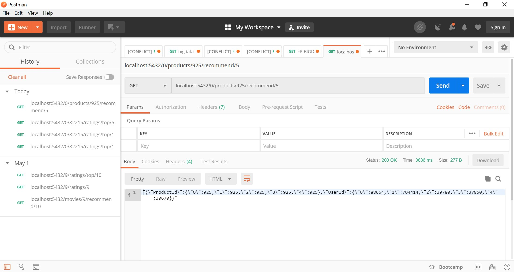

# FP-BIGDATA

## Daftar File

#### server.py
Inisialisasi CherryPy web server dan untuk tempat inisialisasi fungsi dan memanggil app.py

#### app.py
Flask web app yang menghubungkan server.py dengan engine.py dan sebagai tempat routing

#### engine.py
Untuk inisialisasi spark, untuk menjalankan webserver, untuk memanggil app.py dan engine.py, dan setting dataset location  

#### producer.py
Untuk mengirimkan data ke consumer secara per-model, dimana masing-masing model berisi 500.000 data

#### consumer.py
Menerima data dari server kafka yang dimana datasetnya akan kita gunakan pada engine


## Penjelasan
### Limit data pada masing-masing model adalah 500.000
### Model:
1. Model 1: 10.000 data pertama
2. Model 2: 10.000 data kedua
3. Model 3: 10.000 data ketiga

### Akses endpoint API
Dijalankan pada localhost (0.0.0.0) dengan port 5432

## Cara menjalankan
1. Nyalakan zookeeper
2. Nyalakan kafka
3. Buat topic baru pada kafka, dimana pada project ini saya namakan 'amazondata'
```
kafka-topics.bat --create --zookeeper localhost:2181 --replication-factor 1 --partitions 1 --topic amazondata
```
4. Jalankan producer.py
5. Jalankan consumer.py
6. Tunggu beberapa saat untuk menunggu producer mengirim data kepada consumer
7. Jalankan server.py

## URL yang dapat diakses
`http://0000:5432/<int:model>/<int:user_id>/ratings/top/<int:count>`
method = [GET]
<br>
Menampilkan top <int:count> product yang direkomendasikan untuk user <user_id>
<br>

`http://0000:5432/<int:model>/products/<int:product_id>/recommend/<int:count>`
method = [GET]
<br>
Menampilkan product <int:product_id> yang paling direkomendasikan ke sejumlah <count> user
<br>

`http://0000:5432/<int:model>/<int:user_id>/ratings/<int:product_id>`
method = [GET]
<br>
Menampilkan rating <int:product_id> yang diberikan oleh user <int:user_id>
<br>

